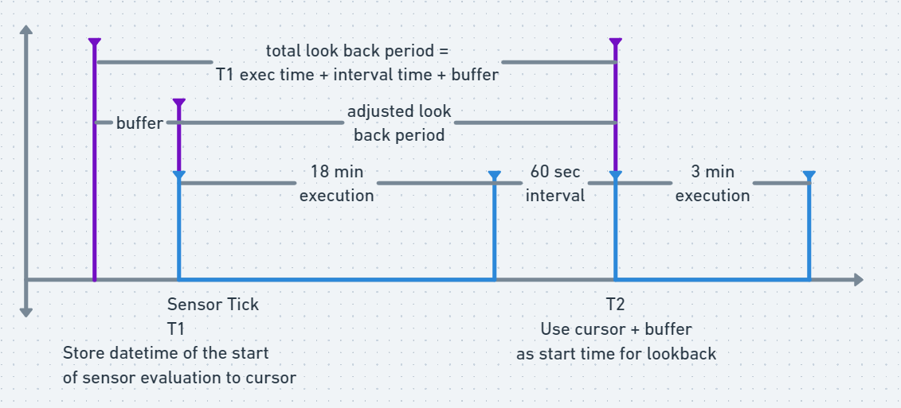

# Dagster Sensors for APIs

## Scenario
1. You need to run a Dagster job based on an external state change. In this example, a new file or data is available from an API. This API has date time parameters which you can use as a filter to get data from a specific period. Example: `fromDate` parameter allows you to get the data from a specific date time in the past up to the present.
2. Data should only be ingested/processed once to save computing resources.

## Sensor
Dagster sensors allow you to instigate runs based on some external state change. In this case, we can write a sensor that detects new data from APIs.

In the code block below assume the functions:
- `date_time_x_min_ago`: returns a date time string with a value that is `timedelta_min` (minutes) from the past
- `get_datetime_now`: returns the current date time as a string
- `add_time_buffer`: requires a date time string as input then returns a date time string with `buffer_minutes` (minutes) subtracted from the input
- `get_list_of_files_from_api`: returns a list of filenames based on the time range defined by `from_date` and `end_date` parameters.

```python
@sensor(job=ingestion_job)
def api_sensor(context):
    start_date_time = (
        context.cursor if context.cursor else date_time_x_min_ago(timedelta_min=15)
    )

    start_date_time_w_buffer = add_time_buffer(
        start_time=start_date_time, buffer_minutes=15
    )

    datetime_now = get_datetime_now()

    context.update_cursor(str(datetime_now))

    filenames = get_list_of_files_from_api(
        from_date=start_date_time_w_buffer, end_date=datetime_now
    )

    for filename in filenames:
        if filename:
            yield RunRequest(run_key=filename, run_config={"filename": filename})
```

The sensor above does the following:
1. The sensor retrieves the `start_date_time` from the cursor. If it has no value, which only happens during the very first sensor execution, it gets the date time 15 minutes ago.
2. Add a 15-minute buffer to `start_date_time` for the sake of sanity. The value of `start_date_time_w_buffer` will be used as a parameter to the API call.
3. After that, it gets the current date time. The cursor will then be updated with the value of the current date time. This new cursor value will be used in the next sensor execution.
4. It then gets the list of filenames from that time period.
5. Lastly, the sensor loops through the list of filenames and yields a `RunRequest` (Dagster job) for each filename. This job will perform the main ingestion logic. The `run_key` is set as the filename and its purpose is to make sure that the filename's job will only run once. Note that `run_key` values should be unique.

The sensor tick history will look like this:



Where:
T1 = First sensor tick/execution
T2 = Second sensor tick
## Pros
- An adjustable look-back period, made possible by the cursors, makes sure that all data are ingested.
- The `run_key` will make sure that jobs are only processed once. If the sensor detects the same file from the API, it will not process it again.

## Cons
- During peak times, wherein a large number of files or data are available from the API, the sensor execution might take a while to finish. Other sensors will be affected since by default, sensors are evaluated serially by Dagster. To solve this, there an option to use multiple threads for Dagster sensors. Make sure to properly allocate compute resources to Dagster daemon if you plan on doing this feature.

```yaml
sensors:
    # Whether to evaluate sensors using an asynchronous thread pool, allowing sensors to execute in parallel.
    useThreads: true
    # The max number of worker threads to use when evaluating sensors. Can be tuned
    # to allow more sensors to run in parallel, but may require allocating more resources to the
    # daemon.
    numWorkers: 2 # Set this greater than 1

```